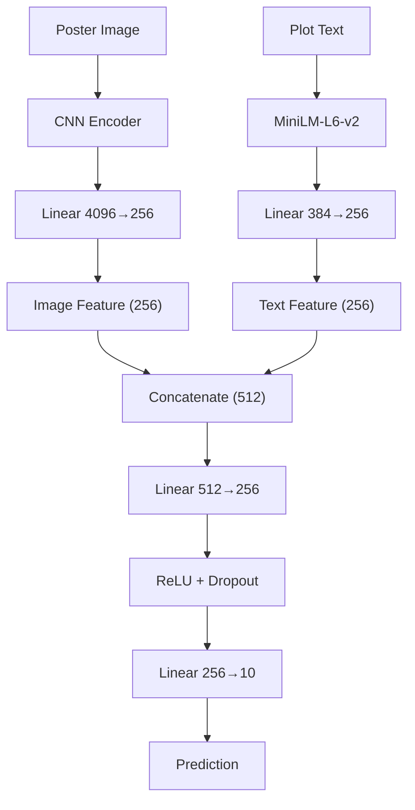
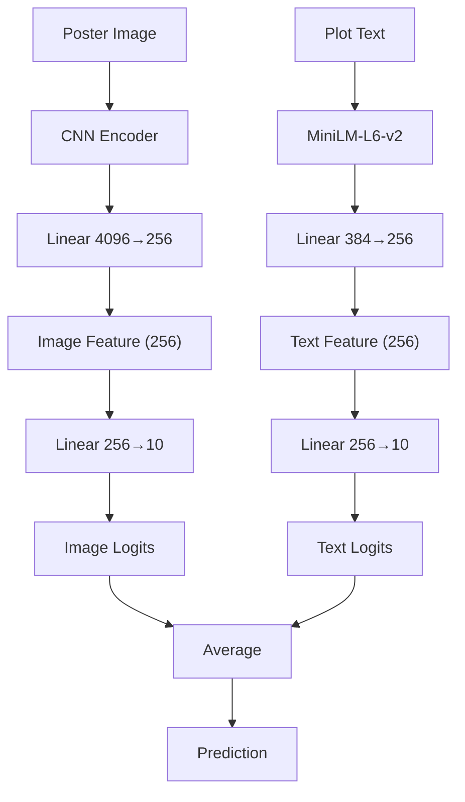
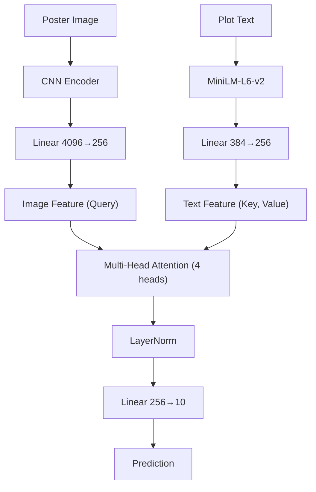
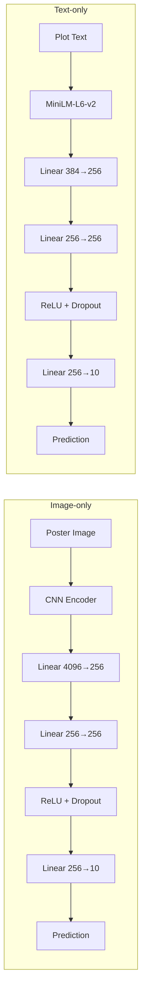

# PPT CNN Fusion Diagram Guide

이 문서는 **CNN 기준 퓨전별 모델 구조를 PPT에 도식화할 때** 바로 참고할 수 있게 정리한 가이드입니다.  
현재 코드 기준 대상은 아래 5개입니다.

- `CNN + early`
- `CNN + late`
- `CNN + joint`
- `CNN + image_only`
- `text_only`

`joint`는 코드상 `cross_attention`으로 구현되어 있지만, 발표에서는 `joint fusion`으로 표기해도 됩니다.

## 1. PPT에서 보여줄 핵심

발표 슬라이드에서는 **backbone 전체를 다 그리기보다**

- 입력
- 이미지 인코더
- 텍스트 인코더
- 퓨전 지점
- classifier / prediction

이 5개만 명확히 보이게 하는 것이 가장 좋습니다.

추천 구성:

1. 한 장: `Early / Late / Joint` 3개 도식
2. 다음 장: `Image-only / Text-only` baseline 도식
3. 부록: CNN 레이어 상세

## 2. 공통 모듈

### 2-1. 이미지 인코더: `CNNImageEncoder`

코드 기준:

- 입력: `3 x 224 x 224`
- Conv block 4회 반복
  - `Conv2d(kernel=3, stride=1, padding=1)`
  - `BatchNorm2d`
  - `ReLU`
  - `MaxPool2d(2)`
- 채널 수: `32 -> 64 -> 128 -> 256`
- Adaptive average pooling: `4 x 4`
- Flatten
- Projection head:
  - `Dropout(0.4)`
  - `Linear(4096 -> 256)`

PPT용 간단 표기:

```text
Poster Image
-> CNN Encoder
-> 256-d Image Feature
```

PPT용 조금 자세한 표기:

```text
Input 3x224x224
-> Conv(3x3,32) + BN + ReLU + MaxPool
-> Conv(3x3,64) + BN + ReLU + MaxPool
-> Conv(3x3,128) + BN + ReLU + MaxPool
-> Conv(3x3,256) + BN + ReLU + MaxPool
-> AdaptiveAvgPool(4x4)
-> Flatten 4096
-> Dropout
-> Linear 4096→256
```

### 2-2. 텍스트 인코더: `TransformerTextEncoder`

코드 기준:

- 모델: `sentence-transformers/all-MiniLM-L6-v2`
- 입력 길이: `max_text_len = 96`
- hidden size: `384`
- CLS token 사용
- Projection head:
  - `Dropout(0.12)`  
    현재 공통 dropout `0.4`를 사용하므로 텍스트 projection에서는 `0.4 * 0.3 = 0.12`
  - `Linear(384 -> 256)`

PPT용 간단 표기:

```text
Plot Text
-> MiniLM-L6-v2
-> 256-d Text Feature
```

PPT용 조금 자세한 표기:

```text
Input Text (96 tokens)
-> MiniLM-L6-v2
-> CLS Embedding 384
-> Dropout
-> Linear 384→256
```

## 3. 퓨전별 실제 구조

### 3-1. Early Fusion

코드 기준:

- 이미지 특징: `256`
- 텍스트 특징: `256`
- 결합: `Concatenate -> 512`
- Classifier:
  - `Linear(512 -> 256)`
  - `ReLU`
  - `Dropout(0.4)`
  - `Linear(256 -> 10)`

PPT 한 줄 요약:

```text
Feature-level fusion: image/text feature를 concat한 뒤 MLP로 분류
```

### 3-2. Late Fusion

코드 기준:

- 이미지 branch:
  - `Linear(256 -> 10)`
- 텍스트 branch:
  - `Linear(256 -> 10)`
- 최종:
  - 두 logits 평균

PPT 한 줄 요약:

```text
Decision-level fusion: 각 모달의 예측 결과를 평균
```

### 3-3. Joint Fusion (`cross_attention`)

코드 기준:

- 이미지 특징 `256` -> Query
- 텍스트 특징 `256` -> Key, Value
- `MultiHeadAttention`
  - heads: `4`
  - dropout: `0.12`
- `LayerNorm(256)`
- `Linear(256 -> 10)`

PPT 한 줄 요약:

```text
Interaction-level fusion: image query가 text key/value를 참조하는 attention 기반 결합
```

## 4. Baseline 구조

### 4-1. Image-only

코드 기준:

- 입력: image feature `256`
- Head:
  - `Linear(256 -> 256)`
  - `ReLU`
  - `Dropout(0.4)`
  - `Linear(256 -> 10)`

### 4-2. Text-only

코드 기준:

- 입력: text feature `256`
- Head:
  - `Linear(256 -> 256)`
  - `ReLU`
  - `Dropout(0.4)`
  - `Linear(256 -> 10)`

## 5. PPT 박스 문구 추천

### 공통 박스 문구

- `Poster Image`
- `CNN Encoder`
- `Linear 4096→256`
- `Image Feature (256)`
- `Plot Text`
- `MiniLM-L6-v2`
- `Linear 384→256`
- `Text Feature (256)`
- `Prediction (10 genres)`

### Early 전용

- `Concatenate`
- `Linear 512→256`
- `ReLU + Dropout`
- `Linear 256→10`

### Late 전용

- `Linear 256→10`
- `Image Logits`
- `Text Logits`
- `Average`

### Joint 전용

- `Image Query`
- `Text Key, Value`
- `Multi-Head Attention (4 heads)`
- `LayerNorm`
- `Linear 256→10`

## 6. 슬라이드 배치 추천

### 추천안 A: 가로 3열

- 왼쪽: `Early Fusion`
- 가운데: `Late Fusion`
- 오른쪽: `Joint Fusion`

각 열은 위에서 아래로 흐르게 구성합니다.

### 추천안 B: 공통 인코더 + 하단 분기

- 상단 공통:
  - `Poster Image -> CNN Encoder -> Image Feature`
  - `Plot Text -> MiniLM -> Text Feature`
- 하단에서
  - `Early`
  - `Late`
  - `Joint`
로 3갈래 분기

발표용으론 **추천안 A**가 더 직관적입니다.

## 7. Mermaid 도식

### 7-1. Early Fusion



### 7-2. Late Fusion



### 7-3. Joint Fusion



### 7-4. Image-only / Text-only



## 8. 발표에서 이렇게 설명하면 좋음

### Early

이미지와 텍스트 특징을 동일한 256차원 공간으로 투영한 뒤 concat하여 분류한다.

### Late

각 모달이 독립적으로 10개 장르 로짓을 생성하고, 두 예측을 평균하여 최종 분류한다.

### Joint

이미지 특징을 query, 텍스트 특징을 key/value로 사용하는 attention으로 모달 간 상호작용을 반영한 뒤 분류한다.

## 9. 권장 표기

발표 슬라이드에는 아래처럼 통일해서 쓰는 것이 가장 깔끔합니다.

- `CNN Encoder`
- `MiniLM-L6-v2`
- `Image Feature (256)`
- `Text Feature (256)`
- `Early Fusion`
- `Late Fusion`
- `Joint Fusion`
- `Prediction (10 genres)`
